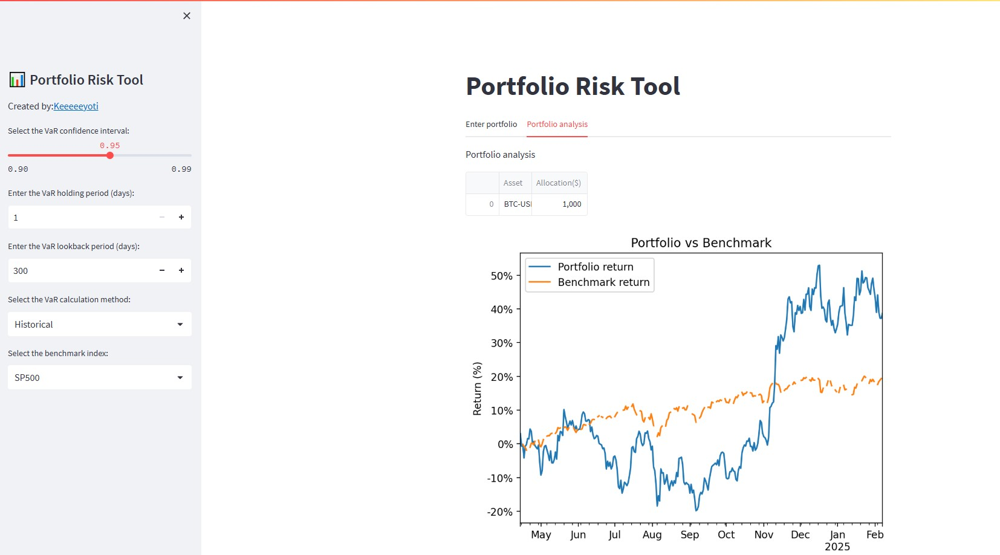
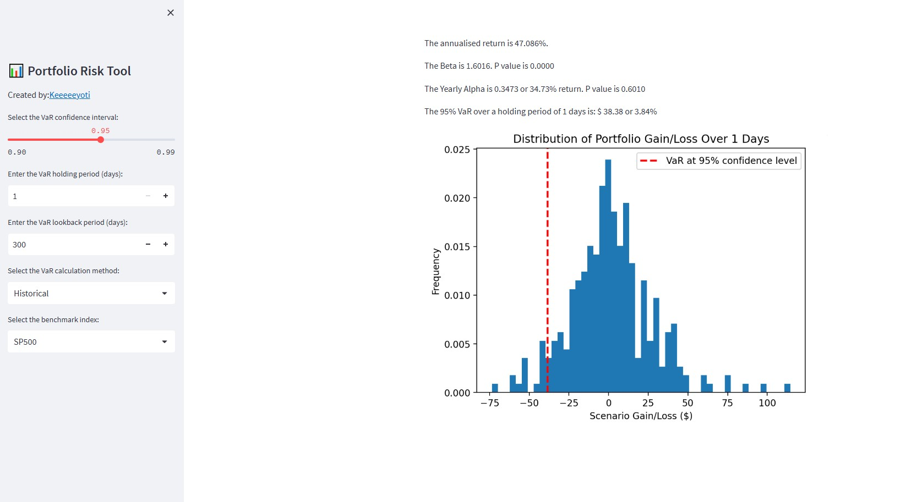

# README for Portfolio Risk Tool

https://portfoliorisktool.streamlit.app/

## Overview
The Portfolio Risk Tool is a Python-based interactive web application built using Streamlit to help assess the risk of a given portfolio. It produces Value-at-Risk (VaR) calculations and portfolio performance metrics such as alpha, beta, and annualized returns. The tool allows users to input their personalised porfolio, performs risk assessments, and visualizes portfolio analytics, helping users understand their specifc market risk.

## Resources Used
Library used: numpy, pandas, yfinance, streamlit, datetime, matplotlib, statsmodels, requests

Risk free rate used:'https://www.macrotrends.net/2492/1-year-treasury-rate-yield-chart'

## Features

* ### Value-at-Risk (VaR) calculations
  User can define confidence level, holding period, lookback period, and select parametric or historical method for VaR calculation. Risk tool also provides a visualisation of the portfolio gain/loss.

* ### Risk metrics
  Risk tool calculates the portfolio annual return, alpha and beta with the selected benchmark index and 1 year treasury as the risk free rate. The performance of user's portfolio is compared with the benchmark index for the lookback period in a line chart.

* ### Data cleaning for products of different trading schedule
  Risk tool will disregard crypto weekend price when portfolio contains both crypto and stock. This approach is chosen as opposed to creating dummy value for weekend prices for stock to ensure the integrity of all data points. Though this approach requires a longer lookback period to produce statistically significant results.

## Demonstration

